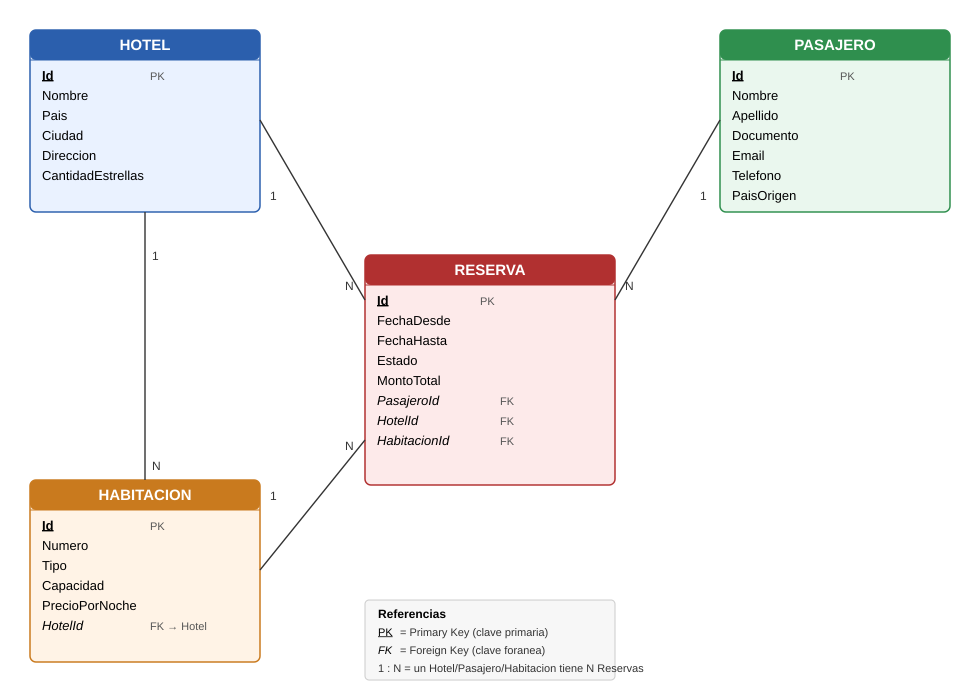

# ORT International Hotel — Ejemplo MVC (Model First + Scaffolding)

Proyecto de ejemplo para la cátedra: una cadena de hoteles ficticia ("ORT International
Hotel", al estilo Sheraton) con sedes en Buenos Aires, Bahamas y Madrid. Se usa para enseñar
el flujo completo de **ASP.NET Core MVC + Entity Framework Core**, desde el modelo de datos
hasta un CRUD (ABM) funcionando contra SQL Server, pasando por migraciones y scaffolding.

- **Framework**: ASP.NET Core MVC (.NET 8)
- **ORM**: Entity Framework Core 8 (Code First / *Model First* desde el punto de vista del
  alumno: se arranca dibujando el modelo relacional y de ahí se generan las clases)
- **Base de datos**: SQL Server LocalDB
- **Patrón de trabajo**: Modelo → Migración (`Add-Migration` / `dotnet ef migrations add`) →
  Base de datos (`Update-Database` / `dotnet ef database update`) → Scaffolding de
  Controllers + Views (ABM)

---

## 1. El dominio: 4 entidades relacionadas

| Entidad | Descripción |
|---|---|
| **Hotel** | Una sede de la cadena (Buenos Aires, Bahamas, Madrid, etc.) |
| **Pasajero** | Un huésped que puede reservar en cualquier sede de la cadena |
| **Habitación** | Pertenece a **un** Hotel. Tiene tipo, capacidad y precio por noche |
| **Reserva** | La entidad "puente": une a un Pasajero con un Hotel y una Habitación en un rango de fechas |

Un pasajero puede tener **varias reservas**, en **distintas fechas**, en **distintos
hoteles** de la cadena. Por eso `Reserva` es la entidad central del modelo, con tres claves
foráneas.

### 1.1 Diagrama Entidad-Relación



> **Convención de nombres usada en el modelo**: toda clave primaria se llama `Id`. Toda
> clave foránea se llama `NombreDeLaEntidad` + `Id` (por ejemplo, en `Reserva`:
> `HotelId`, `PasajeroId`, `HabitacionId`). Esto es lo que Entity Framework espera "por
> convención" para descubrir automáticamente las relaciones sin tener que configurarlas
> a mano con Fluent API.

### 1.2 Multiplicidad de las relaciones

- Un **Hotel** tiene muchas **Habitaciones** (1 a N)
- Un **Hotel** tiene muchas **Reservas** (1 a N)
- Un **Pasajero** tiene muchas **Reservas** (1 a N)
- Una **Habitación** tiene muchas **Reservas** en distintas fechas (1 a N)
- Una **Reserva** pertenece a exactamente un Hotel, un Pasajero y una Habitación

---

## 2. Estructura del proyecto

```
MVC-Ejemplo/
├── ORTInternationalHotel.sln
├── README.md
└── src/
    └── ORTInternationalHotel.Web/
        ├── Models/
        │   ├── Hotel.cs
        │   ├── Pasajero.cs
        │   ├── Habitacion.cs
        │   ├── Reserva.cs
        │   ├── TipoHabitacion.cs      (enum)
        │   └── EstadoReserva.cs       (enum)
        ├── Data/
        │   └── ORTInternationalHotelContext.cs   (DbContext + datos semilla)
        ├── Migrations/                            (generadas por EF Core)
        ├── Controllers/
        │   ├── HotelesController.cs
        │   ├── PasajerosController.cs
        │   ├── HabitacionesController.cs
        │   └── ReservasController.cs
        ├── Views/
        │   ├── Hoteles/       (Index, Create, Edit, Details, Delete)
        │   ├── Pasajeros/     (Index, Create, Edit, Details, Delete)
        │   ├── Habitaciones/  (Index, Create, Edit, Details, Delete)
        │   └── Reservas/      (Index, Create, Edit, Details, Delete)
        ├── appsettings.json    (connection string a LocalDB)
        └── Program.cs
```

Este repositorio **ya incluye** el modelo, la migración inicial y el scaffolding
generado, para que puedan ver el resultado final. La Parte 3 explica cómo se hizo, paso a
paso, para que lo puedan reproducir ustedes mismos desde cero (por ejemplo, en un proyecto
en blanco durante la clase).

---

## 3. Guía paso a paso para los alumnos (Model First → CRUD)

### Paso 0 — Requisitos

- Visual Studio 2022 (17.8+) con la carga de trabajo **ASP.NET y desarrollo web**
- SQL Server Express LocalDB (se instala junto con Visual Studio)
- .NET 8 SDK

### Paso 1 — Crear el proyecto

En Visual Studio: **Archivo → Nuevo → Proyecto → Aplicación web ASP.NET Core (Modelo-Vista-Controlador)**.
Elegir .NET 8, sin autenticación.

Equivalente en consola (lo que se usó para armar este repo):

```bash
dotnet new mvc -n ORTInternationalHotel.Web
```

### Paso 2 — Instalar los paquetes NuGet de Entity Framework Core

Desde la **Consola del Administrador de paquetes** (`Tools → NuGet Package Manager →
Package Manager Console`) o por CLI:

```bash
dotnet add package Microsoft.EntityFrameworkCore.SqlServer
dotnet add package Microsoft.EntityFrameworkCore.Tools
dotnet add package Microsoft.EntityFrameworkCore.Design
```

- `SqlServer`: el proveedor de base de datos.
- `Tools`: habilita `Add-Migration` / `Update-Database` desde la Package Manager Console.
- `Design`: habilita los mismos comandos desde la CLI (`dotnet ef`).

### Paso 3 — Diseñar el diagrama relacional (a mano, en papel o en un editor)

Antes de escribir una sola clase, dibujen el diagrama como el de la sección 1.1: entidades,
atributos, y para cada relación identifiquen **quién tiene la clave foránea**. Esta es la
parte de "Model First" que hacemos nosotros como diseñadores, aunque después el código lo
escribamos a mano (a diferencia del "Database First", donde el diagrama se dibuja en una
herramienta como el EF Designer y esta genera las clases automáticamente).

Regla práctica para pasar del diagrama al código:

1. Cada entidad del diagrama → una clase en `Models/`.
2. Cada atributo → una propiedad pública.
3. Cada relación "muchos a uno" (ej: "una Reserva tiene un Hotel") → en el lado "muchos"
   (Reserva) se agrega una **propiedad relacional** `int HotelId` y una propiedad de
   navegación `Hotel? Hotel`.
4. En el lado "uno" (Hotel) se agrega una **colección de navegación**:
   `ICollection<Reserva> Reservas`.

#### ¿Qué es la "propiedad relacional" (`HotelId`)?

Es el campo que en la base de datos se va a convertir en la **Foreign Key (FK)**: un número
entero que guarda el `Id` del hotel al que pertenece esa habitación o esa reserva. Por
ejemplo, si `Habitacion.HotelId = 1`, esa habitación es del hotel cuyo `Id` es 1
(Buenos Aires). Es exactamente lo mismo que en SQL sería una columna `HotelId INT` con una
restricción `FOREIGN KEY` apuntando a la tabla `Hoteles`.

La propiedad `Hotel? Hotel` (con mayúscula, sin `Id`) que va al lado es la **propiedad de
navegación**: no se guarda como columna en la base de datos, es una comodidad de C# para
que, desde código, puedan escribir `habitacion.Hotel.Nombre` y que EF Core traiga
automáticamente el hotel relacionado (por detrás, hace el `JOIN` por ustedes).

#### ¿Qué es `ICollection<Reserva>`?

Para lo que van a usar en este curso, **piensen `ICollection<Reserva>` como si fuera un
`List<Reserva>`**: es una lista de reservas. De hecho, en el código la inicializamos
literalmente con una lista: `new List<Reserva>()`.

La diferencia es que `ICollection<T>` es una **interfaz** (un "contrato" más genérico que
`List<T>`) que dice "esto es una colección a la que puedo agregar y quitar elementos y
recorrer con `foreach`", sin comprometerse a qué tipo de colección es exactamente por
dentro (podría ser una `List<T>`, un `HashSet<T>`, etc.). Entity Framework Core pide que
las colecciones de navegación se declaren con `ICollection<T>` (o similares) en vez de
`List<T>` porque así, cuando ustedes escriben `hotel.Habitaciones`, es EF quien decide
internamente cómo traer y gestionar esa lista de la base de datos — pero para todo lo que
hacen en clase (recorrerla con `foreach`, contarla con `.Count`, etc.) se comporta igual
que cualquier lista que ya conocen.

En resumen:

| Se ve en el modelo | Qué es | ¿Existe como columna en la BD? |
|---|---|---|
| `int HotelId` | Propiedad relacional / futura FK | Sí — es la columna con la clave foránea |
| `Hotel? Hotel` | Propiedad de navegación (1 solo objeto relacionado) | No — la arma EF Core al consultar |
| `ICollection<Reserva> Reservas` | Colección de navegación (lista de objetos relacionados) | No — la arma EF Core al consultar |

### Paso 4 — Crear las clases de modelo

Ejemplo simplificado de `Habitacion.cs` (el proyecto real usa Data Annotations para
validaciones, ver el archivo completo en [`Models/Habitacion.cs`](src/ORTInternationalHotel.Web/Models/Habitacion.cs)):

```csharp
public class Habitacion
{
    public int Id { get; set; }
    public string Numero { get; set; }
    public TipoHabitacion Tipo { get; set; }
    public int Capacidad { get; set; }
    public decimal PrecioPorNoche { get; set; }

    // Propiedad relacional (futura Foreign Key): NombreDelModelo + Id
    public int HotelId { get; set; }
    public Hotel? Hotel { get; set; }

    public ICollection<Reserva> Reservas { get; set; } = new List<Reserva>();
}
```

Repitan este análisis para `Hotel`, `Pasajero` y `Reserva` (la entidad `Reserva` va a tener
**tres** propiedades FK: `HotelId`, `PasajeroId`, `HabitacionId`).

### Paso 5 — Crear el `DbContext`

El `DbContext` es la clase que representa la conexión a la base de datos y expone un
`DbSet<T>` por cada entidad (equivalente a una tabla):

```csharp
public class ORTInternationalHotelContext : DbContext
{
    public ORTInternationalHotelContext(DbContextOptions<ORTInternationalHotelContext> options)
        : base(options) { }

    public DbSet<Hotel> Hoteles { get; set; }
    public DbSet<Pasajero> Pasajeros { get; set; }
    public DbSet<Habitacion> Habitaciones { get; set; }
    public DbSet<Reserva> Reservas { get; set; }
}
```

Ver el archivo completo en
[`Data/ORTInternationalHotelContext.cs`](src/ORTInternationalHotel.Web/Data/ORTInternationalHotelContext.cs):
además define con Fluent API el comportamiento de borrado (`OnDelete`) de cada FK de
`Reserva`, y carga datos de ejemplo con `HasData` (seed).

### Paso 6 — Registrar el `DbContext` y el connection string

En `appsettings.json`:

```json
"ConnectionStrings": {
  "ORTInternationalHotelContext": "Server=(localdb)\\mssqllocaldb;Database=ORTInternationalHotelDb;Trusted_Connection=True;MultipleActiveResultSets=true;TrustServerCertificate=True"
}
```

En `Program.cs`, antes de `builder.Build()`:

```csharp
builder.Services.AddDbContext<ORTInternationalHotelContext>(options =>
    options.UseSqlServer(builder.Configuration.GetConnectionString("ORTInternationalHotelContext")));
```

### Paso 7 — Crear la migración inicial (`Add-Migration`)

Una **migración** es el "diff" entre el modelo de clases (C#) y el esquema real de la base
de datos. EF Core la traduce a SQL automáticamente.

**Desde Visual Studio** (Package Manager Console, con el proyecto Web seleccionado como
"Default project"):

```powershell
Add-Migration InitialCreate
```

**Desde la terminal** (lo que se usó en este repo):

```bash
dotnet ef migrations add InitialCreate -o Migrations
```

Esto genera 3 archivos en `Migrations/`:

- `..._InitialCreate.cs`: el método `Up()` (qué SQL correr para crear las tablas) y
  `Down()` (cómo deshacerlo).
- `..._InitialCreate.Designer.cs`: metadata que usa EF internamente.
- `ORTInternationalHotelContextModelSnapshot.cs`: una "foto" del modelo actual, para que la
  próxima migración sepa qué cambió.

**Importante para explicar en clase**: en este punto **todavía no existe la base de
datos**. Solo se generó el script en C#/SQL que la va a crear.

### Paso 8 — Aplicar la migración (`Update-Database`)

**Desde Visual Studio**:

```powershell
Update-Database
```

**Desde la terminal**:

```bash
dotnet ef database update
```

Esto sí crea la base `ORTInternationalHotelDb` en LocalDB, con las 4 tablas, sus claves
foráneas, índices, y los datos de ejemplo (seed). Pueden verificarlo en Visual Studio desde
**View → SQL Server Object Explorer → (localdb)\MSSQLLocalDB → Databases**.

> Cuando en una clase futura agreguen una propiedad nueva a un modelo (por ejemplo,
> `Pasajero.FechaNacimiento`), el flujo se repite: `Add-Migration AgregarFechaNacimiento`
> y después `Update-Database`. Nunca se edita la base de datos a mano.

### Paso 9 — Scaffolding: generar el ABM (CRUD) automáticamente

Con el modelo y la base ya creados, Visual Studio puede **generar automáticamente** el
Controller y las 5 Vistas (Index, Create, Edit, Details, Delete) de cada entidad.

**Desde Visual Studio**: clic derecho sobre la carpeta `Controllers` → **Agregar →
Controlador nuevo → Controlador MVC con vistas, usando Entity Framework**. Elegir el
modelo (por ejemplo `Reserva`) y el `DbContext` (`ORTInternationalHotelContext`).

**Desde la terminal** (herramienta `dotnet-aspnet-codegenerator`, lo que se usó en este
repo):

```bash
dotnet tool install -g dotnet-aspnet-codegenerator

dotnet aspnet-codegenerator controller \
  -name ReservasController \
  -m ORTInternationalHotel.Web.Models.Reserva \
  -dc ORTInternationalHotel.Web.Data.ORTInternationalHotelContext \
  -outDir Controllers \
  --useDefaultLayout \
  --referenceScriptLibraries
```

Repitan el comando para `Hotel`, `Pasajero` y `Habitacion`. El generador es lo bastante
inteligente para detectar las propiedades FK (`HotelId`, `PasajeroId`, `HabitacionId`) y
arma automáticamente `<select>` (dropdowns) en las vistas `Create`/`Edit`, poblados con
`ViewBag.HotelId = new SelectList(_context.Hoteles, "Id", "Nombre")`, etc.

### Paso 10 — Correr la aplicación

```bash
dotnet run --project src/ORTInternationalHotel.Web
```

Y navegar a `https://localhost:xxxx/Reservas` (o cualquiera de los otros controllers). El
menú de navegación del layout ya tiene links a los 4 ABMs.

### Resumen del orden Model First

```
Diagrama relacional (papel/pizarrón)
        │
        ▼
Clases de Modelo (Models/*.cs)
        │
        ▼
DbContext (Data/*.cs) + connection string
        │
        ▼
Add-Migration  (genera el script de creación de tablas)
        │
        ▼
Update-Database  (crea/actualiza la base de datos real)
        │
        ▼
Scaffolding de Controllers + Views  (genera el CRUD/ABM)
        │
        ▼
dotnet run  (¡a probar el ABM!)
```

---

## 4. Cómo correr este proyecto ya armado

```bash
# 1. Clonar el repo
git clone <url-del-repo>
cd MVC-Ejemplo

# 2. Restaurar paquetes
dotnet restore

# 3. Crear la base de datos local (si no existe todavía)
cd src/ORTInternationalHotel.Web
dotnet ef database update

# 4. Ejecutar
dotnet run
```

Abrir la URL que muestra la consola (por ejemplo `http://localhost:5080`) y navegar por
Hoteles, Pasajeros, Habitaciones y Reservas.

Si algún alumno no tiene LocalDB, puede cambiar el connection string en
`appsettings.json` por el de su instancia de SQL Server (Express, Developer, o incluso un
contenedor Docker).

---

## 5. Ideas para que los alumnos extiendan el ejemplo

- Agregar validación de **fechas superpuestas**: que no se pueda reservar la misma
  habitación en fechas que se solapan con otra reserva.
- Calcular `MontoTotal` automáticamente a partir de `PrecioPorNoche` y la cantidad de
  noches, en vez de cargarlo a mano.
- Agregar una nueva entidad `Servicio` (desayuno, spa, cochera) en relación N a N con
  `Reserva` (tabla intermedia `ReservaServicio`).
- Agregar un `Empleado` por Hotel, y mostrar en el Index de Reservas quién la gestionó.
- Pasar las vistas a Bootstrap con tarjetas (`card`) en vez de tablas simples.

Cualquier mejora que se les ocurra, es bienvenida — este proyecto está pensado como punto
de partida, no como versión final.
